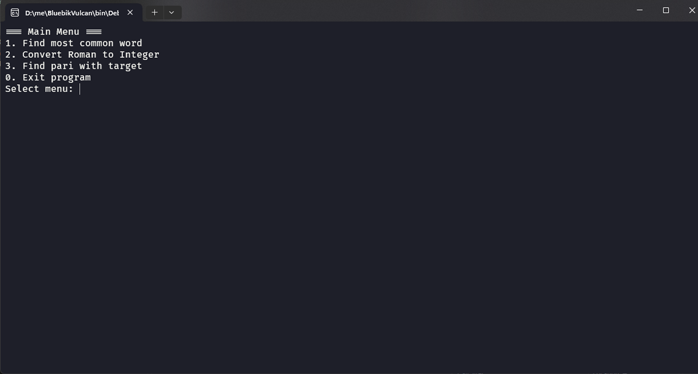
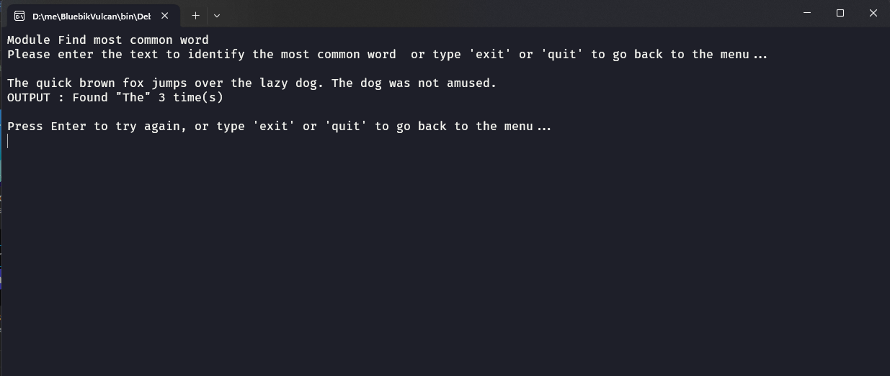
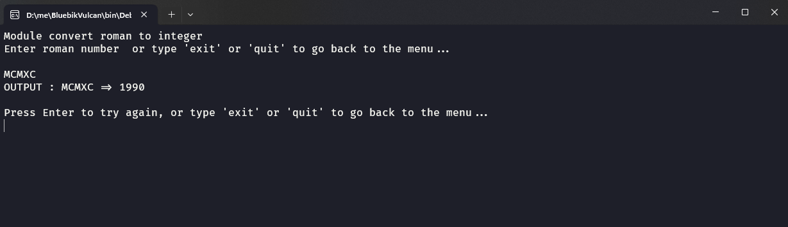
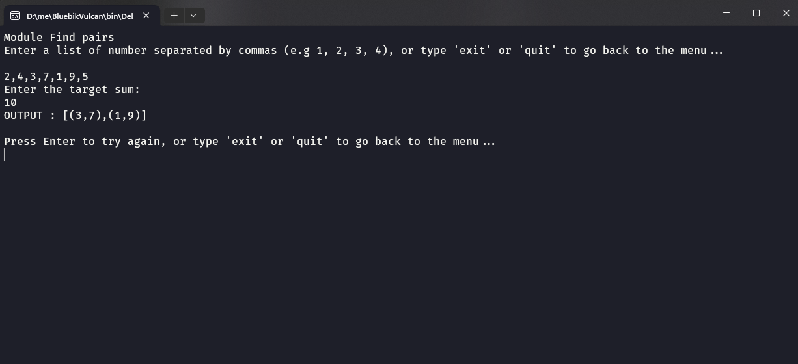

## 🖥️ Console App
  โปรแกรมคอนโซลที่มีโมดูลหลัก 3 ส่วน

## 🚀 โมดูล
- **Find most common word**: เป็น module ที่ใช้สำหรับค้นหาคำที่แสดงผลมากที่สุด โดยไม่สนตัวพิมพ์เล็กพิมพ์ใหญ่ (The กับ the นับเป็นคำเดียวกัน)
- **Roman to integer**: เป็น module ที่ใช้สำหรับการแปลงค่าจากเลขโรมันไปเป็น Integer
- **Find pairs**: เป็น module ที่ใช้สำหรับการจับคู่ตัวเลขที่มีค่าเท่ากับ taget ที่กำหนด


### 📸 พรีวิว
 
 
- **Module Find most common word**:
- **Module Convert roman to integer**: 
- **Module Find pairs**: 


### 🛠️ เทคโนโลยีที่ใช้

- **C#**:  ใช้ในการพัฒนาและสร้างตรรกะหลักของแอปพลิเคชันในรูปแบบคอนโซล
- **.Net**: แพลตฟอร์มซอฟต์แวร์ที่ใช้ในการสร้างและรันแอปพลิเคชัน รวมถึงการจัดการการประมวลผลตรรกะในแอปพลิเคชันคอนโซล
- **Console app**: แอปพลิเคชันแบบคอนโซลที่ใช้สำหรับทดสอบและใช้งานโมดูลต่าง ๆ ที่กล่าวถึงข้างต้น โดยมีอินเตอร์เฟซที่ง่ายต่อการใช้งานของผู้ใช้


### 🖱️ การใช้งาน
[win-x64 (Window)](https://drive.google.com/file/d/1dd5MqFP_p3UetFJI1rUGORhxAi9m6JJa/view?usp=drive_link)
<br/>
[linux-x64 (Linux)](https://drive.google.com/file/d/1JQ90egw1SowxhX3S_IyS_PekUEpKBcw-/view?usp=drive_link)
<br/>
[osx-arm64 (Apple Silicon) ](https://drive.google.com/file/d/1cSzPfPRsiG-wqlYm5ficS3O9ks05X9fd/view?usp=drive_link)
<br/>
[osx-x64 (Intel)](https://drive.google.com/file/d/12DloSBNX8P-5taY8wqufLp1MyCwjT0TD/view?usp=drive_link)

### 1. Windows 💻
**ขั้นตอนในการเปิดไฟล์ ZIP:**
1. เมื่อดาวน์โหลดเสร็จแล้ว ให้คลิกขวาที่ไฟล์ ZIP
   - เลือก **Extract All...** หรือ **แตกไฟล์ทั้งหมด**
   - เลือกตำแหน่งที่คุณต้องการให้ไฟล์ถูกบันทึก
2. หลังจากแตกไฟล์แล้ว คุณจะเห็นโฟลเดอร์ที่มีไฟล์ทั้งหมด
3. คลิกที่ไฟล์ **.exe** เพื่อเปิดโปรแกรมของคุณและเริ่มใช้งาน

### 2. macOS (Apple Silicon / M1, M2 & Intel) 🍏
**ขั้นตอนในการเปิดไฟล์ ZIP:**
1. เมื่อดาวน์โหลดเสร็จแล้ว ให้ดับเบิลคลิกที่ไฟล์ ZIP
   - macOS จะทำการแตกไฟล์โดยอัตโนมัติ และคุณจะเห็นโฟลเดอร์ที่มีไฟล์ทั้งหมด
2. เปิด **Terminal** (จาก **Applications > Utilities > Terminal**)
3. ไปยังโฟลเดอร์ที่คุณได้บันทึกไฟล์ ZIP และแตกไฟล์
 ```sh
 cd /path/to/your/folder
  ```
4. ใช้คำสั่งใน **Terminal** เพื่อรันโปรแกรม:
 ```sh
   ./BluebikTest
   ```
 
  

### 3. Linux 🐧
**ขั้นตอนในการเปิดไฟล์ ZIP:**
1. เมื่อดาวน์โหลดเสร็จแล้ว ให้เปิด **Terminal** (สามารถกด `Ctrl + Alt + T` เพื่อเปิด)
2. ใช้คำสั่ง `cd` ไปยังโฟลเดอร์ที่ไฟล์ ZIP ถูกบันทึก
 ```sh
   cd /path/to/your/folder
   ```
3. ใช้คำสั่ง `unzip` เพื่อแตกไฟล์ ZIP
```sh
unzip yourfile.zip
```
4. หลังจากที่ไฟล์ถูกแตกแล้ว ให้ไปยังโฟลเดอร์ที่ไฟล์ถูกแตก และใช้คำสั่งต่อไปนี้เพื่อรันโปรแกรม:
  ```sh
./BluebikTest
```
5. หมายเหตุ: คุณอาจจะต้องให้สิทธิ์ในการรันไฟล์ด้วยคำสั่ง:
   ```sh
   chmod +x BluebikTest
   ```
  

### 🔧 การติดตั้งโปรเจกต์

1. โคลนโปรเจกต์:
   ```sh
   git clone https://github.com/boypirunporn/BluebikTest.git  
   ```
2. ติดตั้ง Dependencies:  สำหรับโปรเจกต์ C#/.Net ให้ทำการเปิดโปรเจกต์ใน Visual Studio หรือ Visual Studio Code และให้แน่ใจว่าได้ติดตั้ง .NET SDK ที่รองรับกับเวอร์ชันของโปรเจกต์แล้ว

   
4. การรันโปรเจกต์: หลังจากเปิดโปรเจกต์แล้ว สามารถรันโปรเจกต์ได้โดยการใช้คำสั่ง
   ```sh
   dotnet run
   ```
   หรือรันผ่านตัว IDE ที่ต้องการใช้งาน เช่น Visual Studio Code หรือ Visual Studio

